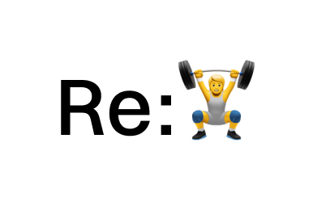

<p align="center">
  
</p>

<h1 align="center"><code>retrain</code></h1>
<p align="center"><strong>Upgrade Your LLM, The Simple Way.</strong></p>

`retrain` is a Python library that uses Reinforcement Learning (RL) to help your Large Language Models (LLMs) learn new skills, master specific tasks, or follow complex instructions. Our goal is to provide a flexible framework that can work with various RL backends (like TRL, Verl, etc.) in the future.

## Why `retrain`?

*   🚀 **Go Beyond Prompts:** Truly teach your LLM, don't just prompt it.
*   🎯 **Achieve Specific Goals & Styles:** Make your LLM excel at specialized tasks, generate text in a particular style, or adhere to specific constraints.
*   🛠️ **Enable Tool Use:** Allow your LLMs to interact with external tools within controlled environments.
*   🧩 **Simplify RL for LLMs:** We handle many RL complexities so you can focus on defining *what* your AI should learn and *how*.

## How It Works: Guiding Your LLM (The Core Loop)

Imagine you want to teach your LLM to write a special kind of cat poem. Here's the basic idea:

1.  **You Give a Task (Prompt):**
    *   Your LLM gets a starting instruction, like: `"Compose a short poem about a happy cat."`

2.  **The LLM Tries (Generation & Interaction):**
    *   The LLM generates a poem.
    *   If the task were more complex (e.g., needing to research cat facts first), it might happen in an `Environment`. In an environment, the LLM could use `tools` (like a search engine, or MCP) and take several `steps` to gather info before writing. This whole interactive attempt is called a `rollout`.

3.  **The LLM Produces an Output:**
    *   You get the poem the LLM wrote.

4.  **You Judge the Result (Your Rules, Your Rewards):**
    *   This is where `retrain` helps your LLM learn. You define what makes a *good* cat poem *for your specific needs*:
        *   **Verifiers (Basic Checks):** First, quick pass/fail checks. For example: `Is it actually a poem?` `Does it mention a cat?` These are like hardcoded rules.
        *   **Reward Functions (Guidance & Goals):** Then, more nuanced scoring. You can reward the LLM for creativity or for capturing a happy cat vibe. 
            Crucially, you can also guide its behavior by adding **constraints**. Let's say you want this happy cat poem *without using the letter "s"*. You would set up a reward function to heavily *penalize* any use of the letter "s".

5.  **The LLM Learns:**
    *   The LLM uses all this feedback (scores for good things, penalties for breaking constraints) to adjust its approach. Over many attempts, it learns to write happy cat poems that also avoid the letter "s".

## Quick Peek: Setting Up Your "Guidance" (Conceptual)

Typically, you'd describe your task and rules in a configuration file (often YAML):

```yaml
# Conceptual Task: Happy Cat Poem (No "s"!)

# 1. Which LLM are you teaching?
model_to_train: "your-favorite-llm"

# 2. What's the overall task?
learning_task: "Write happy cat poems, specifically avoiding the letter 's'."

# 3. How do interactions start?
example_prompts:
  - "Compose a joyful feline lyric."
  - "Draft a cheerful ode to a purring companion."

# 4. Your rules for a good poem:
verifiers: # Basic pass/fail checks
  - rule: "is_actually_a_poem"
  - rule: "mentions_a_cat"

rewards: # Scoring the good and penalizing the unwanted
  goal: "Poem is happy, creative, and about a cat."
  constraints:
    - type: "penalize_text_containing"
      text_to_avoid: "s"
      penalty_score: -100.0 # Make it really learn to avoid "s"!
```
*(**Remember:** This is a simplified concept...)*

## Making it Learn (Conceptual Python)

Then, a small Python script kicks off the training:

```python
import asyncio
from retrain import run 
# Assume your_poem_task_setup is loaded from a YAML like above
# (using retrain.config_models.TrainingConfig.from_yaml(...).model_dump())

async def main(your_poem_task_setup):
    print(f"Starting to train LLM for: {your_poem_task_setup.get('learning_task')}")
    await run(config=your_poem_task_setup)
    print("Training finished! Your LLM is now a better poet (hopefully without \"s\"s).")

# if __name__ == "__main__":
#     conceptual_config = { ... } 
#     asyncio.run(main(conceptual_config)) 
```

## What Can You Achieve?

With `retrain`, you can guide your LLMs to:
*   Master specific writing styles (e.g., formal, humorous, or terse like our no-"s" poet).
*   Reliably use your company's internal APIs or tools to answer questions.
*   Generate code following particular patterns or for specific frameworks.
*   Improve conversational abilities for chatbots, making them stick to certain topics or tones.
*   And much more – if you can define it with rules and rewards, you can `retrain` for it!

## Dive Deeper & See it in Action

Ready to build something real or understand the nuts and bolts?

*   ➡️ **Explore Runnable Examples:** Check out the [`examples/`](./examples/) directory for practical, working code that shows full configurations.
*   📚 **Read the Full Guide:** For detailed explanations, advanced topics, and component deep-dives, see our [`docs/guide.md`](./docs/guide.md).
*   ⚙️ **All Configuration Options:** The complete schema for configuration files is in [`retrain/config_models.py`](./retrain/config_models.py).

---

```bash
uv add retrain
```

## A Note from the Developer & Acknowledgements

This `retrain` library was initially developed over a focused 5-day period, primarily during free time after work. It began as an exploration of ideas, partly inspired by other projects in the community, and evolved into this standalone package. While a lot of effort has gone into making it useful, please approach it with the understanding that it's a young project. Your patience and feedback are highly appreciated!

The development of `retrain` has been significantly influenced by and builds upon the great work of others in the open-source community:

*   **[willccbb/verifiers](https://github.com/willccbb/verifiers):** This project was a key inspiration. `retrain` initially started as an exploration (and even an early PR attempt) related to the concepts found in `willccbb/verifiers`, particularly around ensuring reliability in LLM interactions within environments. `retrain` represents my own path in exploring this approach to RL with LLMs.
*   **[slime](https://github.com/THUDM/slime):** As been of great value in understanding the infrastructure and build a mental model of what I wanted retrain to be. A lot of the code is highly inspired from there.
*   **Unsloth & their Blog:** The blog posts from the Unsloth team were of big value in quickly understanding part of the algorithm (the verifier + reward come from there). For users seeking maximum performance, `retrain` is designed to be compatible with Unsloth, allowing for significantly faster training and reduced memory usage. I will explore even more of their features in the future.

Thank you for trying out `retrain`! If you find it helpful, have ideas for improvement, or would like to contribute, your input is warmly welcomed. Community contributions are key to making this tool even better.

---
Contributions welcome! 